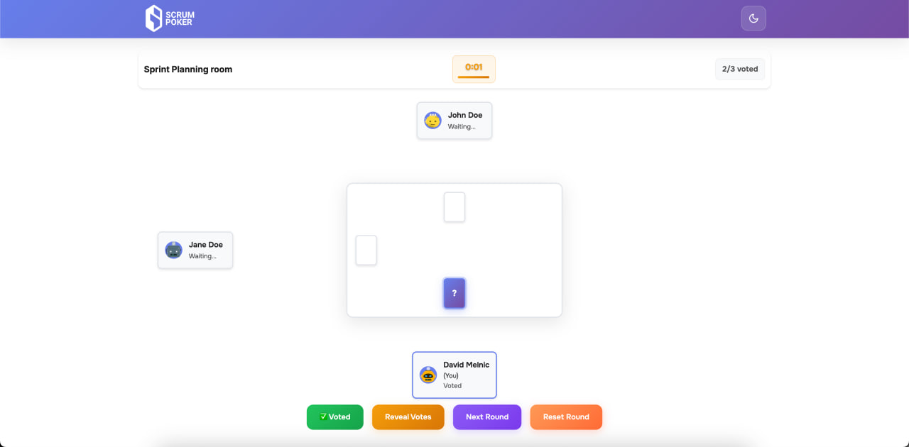
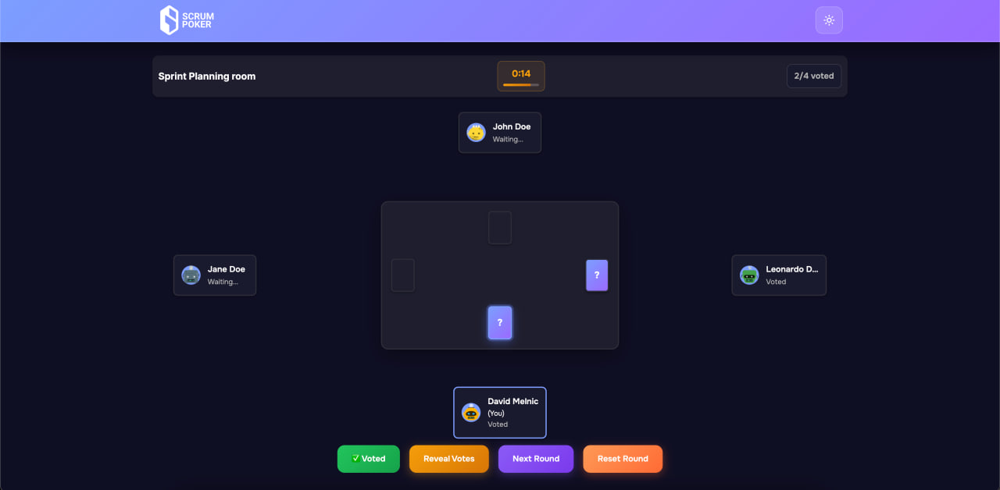
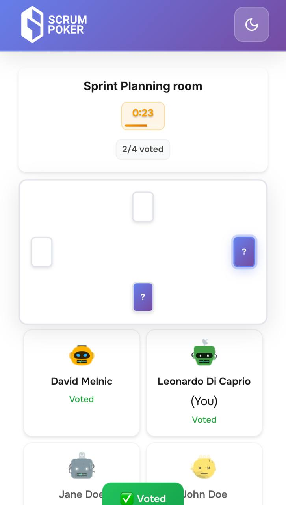

# 🃏 Scrum Poker

A real-time Scrum Poker (Planning Poker) app for agile teams to collaboratively estimate tasks. Built with a modern React frontend and Node.js/Express backend, and powered by WebSockets for seamless real-time collaboration.

🌐 **Live Demo:** [scrum-poker-game.netlify.app](https://scrum-poker-game.netlify.app/)


---

## 🚀 Features

* 🔄 Real-time voting with WebSocket-based updates
* 🏠 Create or join estimation rooms (up to 10 participants)
* 💬 Visual feedback and synced voting flow
* 🌙 Light/Dark theme support
* 📱 Mobile-optimized and touch-friendly
* 💾 MongoDB-based persistent storage
* 🧠 Smart fallback to polling for mobile stability
* 📦 Easy local setup and deployment-ready for platforms like Netlify and Render

---

## 🎨 UI/UX Highlights

### 🖥️ Desktop

* Responsive card-based interface
* Smooth animations and real-time syncing
* Keyboard shortcuts for faster interaction

### 📱 Mobile

* Fully responsive and touch-optimized
* Mobile-specific navigation with stable performance
* Fast loading on low-bandwidth networks

---

## 🗂️ Project Structure

```
├── backend/         # Node.js/Express backend
│   ├── controllers/
│   ├── models/
│   ├── routes/
│   ├── sockets/
│   ├── utils/
│   ├── server.js
│   └── config.js
├── frontend/        # React frontend (Vite + TypeScript)
│   ├── public/
│   ├── src/
│   ├── index.html
└── README.md
```

---

## ⚙️ Requirements

* Node.js (v18+ recommended)
* npm (v9+ recommended)
* MongoDB instance (local or cloud)

---

## 🧪 Run Locally

### 1. Clone the Repository

```bash
git clone https://github.com/daweed311/scrum-poker.git
cd scrum-poker
```

### 2. Set Up the Backend

```bash
cd backend
npm install

# Copy environment example and configure
cp env.example .env
# Edit `.env` to include your MongoDB URI and other settings

# Start the backend server
npm run dev   # for development with nodemon
# or
npm start     # for production
```

### 3. Set Up the Frontend

```bash
cd ../frontend
npm install
npm run dev   # Starts React app at http://localhost:5173
```

> The frontend connects to the backend running at `http://localhost:3001` by default.

---

## 📸 Screenshots

### 🖥️ Desktop View

<div style="display:flex; gap:1rem; flex-wrap: wrap; justify-content: center;">
  
  
</div>

---

### 📱 Mobile View

<div style="display:flex; gap:1rem; flex-wrap: wrap; justify-content: center;">
  
  
</div>

---

## 🧰 Tech Stack

* **Frontend:** React, TypeScript, Vite, Emotion, Socket.io-client, Axios
* **Backend:** Node.js, Express, Socket.io, Mongoose, MongoDB
* **Deployment-Ready For:** Netlify (Frontend) + Render (Backend)

## 📄 License

MIT License. See [LICENSE](LICENSE) for full details.
