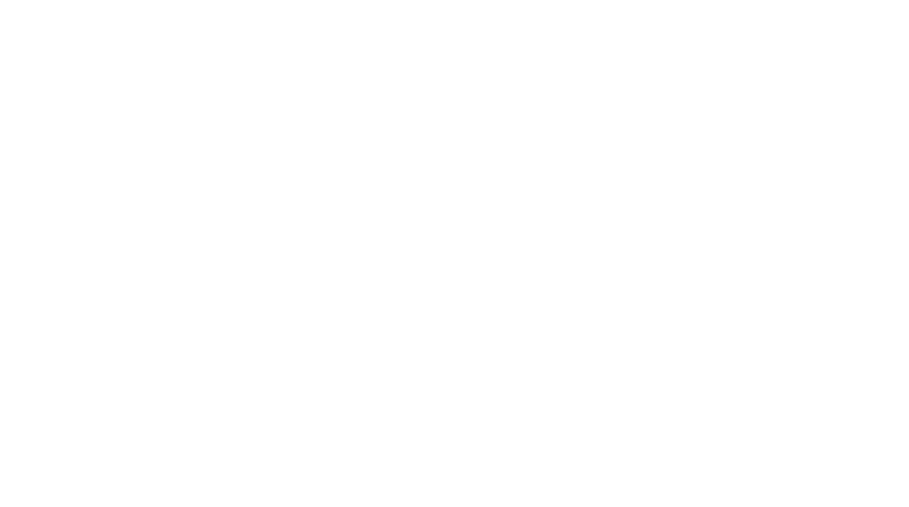

# Scrum Poker

A real-time Scrum Poker (Planning Poker) application for agile teams to estimate tasks collaboratively. Built with a modern React frontend and Node.js/Express backend, using WebSockets for real-time updates.



---

## Features
- Real-time voting and updates using WebSockets
- Create and join rooms for estimation sessions
- Modern, responsive UI
- Persistent data storage with MongoDB
- Easy to set up and run locally
- Ready for Render deployment

---

## Project Layout

```
├── backend/         # Node.js/Express backend (API, WebSocket, MongoDB)
│   ├── controllers/
│   ├── models/
│   ├── routes/
│   ├── sockets/
│   ├── utils/
│   ├── server.js
│   ├── config.js
│   ├── env.example
│   └── ...
├── frontend/        # React frontend (Vite, TypeScript, Emotion, etc.)
│   ├── public/
│   ├── src/
│   ├── index.html
│   └── ...
└── README.md
```

---

## Requirements
- Node.js (v18+ recommended)
- npm (v9+ recommended)
- MongoDB (local or cloud instance)

---

## Setup Instructions

### Local Development

#### 1. Clone the repository
```bash
git clone https://github.com/daweed311/scrum-poker.git
cd scrum-poker
```

#### 2. Backend Setup
```bash
cd backend
npm install

# Create .env file from example
cp env.example .env
# Edit .env with your MongoDB URI and other variables

npm run dev   # For development (nodemon)
# or
npm start     # For production
```

#### 3. Frontend Setup
```bash
cd ../frontend
npm install
npm run dev   # Starts the React app on localhost:5173 (default)
```

#### 4. Open the App
- Visit `http://localhost:5173` in your browser.
- The frontend will connect to the backend (default: `http://localhost:3001`).

---

## Render Deployment

### Backend Deployment

1. **Create a new Web Service** on Render
2. **Connect your GitHub repository**
3. **Configure the service:**
   - **Name:** `scrum-poker-backend`
   - **Root Directory:** `backend`
   - **Runtime:** `Node`
   - **Build Command:** `npm install`
   - **Start Command:** `npm start`

4. **Set Environment Variables** in Render Dashboard:
   - Go to your service → **Environment** tab
   - Add the following variables:

   | Key | Value | Description |
   |-----|-------|-------------|
   | `MONGODB_URI` | `your_mongodb_connection_string` | Your MongoDB connection string |
   | `NODE_ENV` | `production` | Environment setting |
   | `PORT` | `10000` | Port (Render will override this) |

5. **Deploy** - Render will automatically deploy your service

### Frontend Deployment

#### Option 1: Netlify (Recommended)

1. **Connect to Netlify:**
   - Go to [Netlify](https://netlify.com) and sign in
   - Click "New site from Git"
   - Connect your GitHub repository

2. **Configure the build settings:**
   - **Base directory:** `frontend`
   - **Build command:** `npm run build`
   - **Publish directory:** `dist`

3. **Environment Variables** (Optional - now automatic):
   - The frontend automatically detects the environment and uses the correct backend URL
   - For development: `http://localhost:3001`
   - For production: `https://scrum-poker-9c6i.onrender.com`

4. **Deploy** - Netlify will build and deploy your frontend

#### Option 2: Render Static Site

1. **Create a new Static Site** on Render
2. **Connect your GitHub repository**
3. **Configure the service:**
   - **Name:** `scrum-poker-frontend`
   - **Root Directory:** `frontend`
   - **Build Command:** `npm install && npm run build`
   - **Publish Directory:** `dist`

4. **Environment Variables** (Optional - now automatic):
   - The frontend automatically detects the environment and uses the correct backend URL
   - For development: `http://localhost:3001`
   - For production: `https://scrum-poker-9c6i.onrender.com`

5. **Deploy** - Render will build and deploy your frontend

### Environment Variables Setup

Based on [Render's environment variables documentation](https://render.com/docs/configure-environment-variables), you only need to set environment variables for the **backend service**:

#### Backend Environment Variables (Required)
1. Go to your backend service → **Environment** tab
2. Click **+ Add Environment Variable**
3. Add the following variables:

| Key | Value | Description |
|-----|-------|-------------|
| `MONGODB_URI` | `your_mongodb_connection_string` | Your MongoDB connection string |
| `NODE_ENV` | `production` | Environment setting |

#### Frontend Environment Variables (Automatic)
- The frontend automatically detects the environment using `import.meta.env.DEV`
- No manual environment variable setup required
- Development: Uses `http://localhost:3001`
- Production: Uses `https://scrum-poker-9c6i.onrender.com` (works with both Netlify and Render frontend)

---

## Usage
- Create a room and share the code with your team.
- Team members join the room and vote in real time.
- Reveal votes, discuss, and re-vote as needed.

---

## Images & Screenshots
- Add screenshots or GIFs below to showcase the app:

```


```

---

## Tech Stack
- **Frontend:** React, TypeScript, Vite, Emotion, Socket.io-client, Axios
- **Backend:** Node.js, Express, Socket.io, Mongoose, MongoDB
- **Deployment:** 
  - Backend: Render (Web Service)
  - Frontend: Netlify (Static Site) or Render (Static Site)

---

## Contributing
Pull requests are welcome! For major changes, please open an issue first to discuss what you would like to change.

1. Fork the repo
2. Create your feature branch (`git checkout -b feature/your-feature`)
3. Commit your changes (`git commit -am 'Add new feature'`)
4. Push to the branch (`git push origin feature/your-feature`)
5. Open a pull request

---

## License
MIT License. See [LICENSE](LICENSE) for details.
